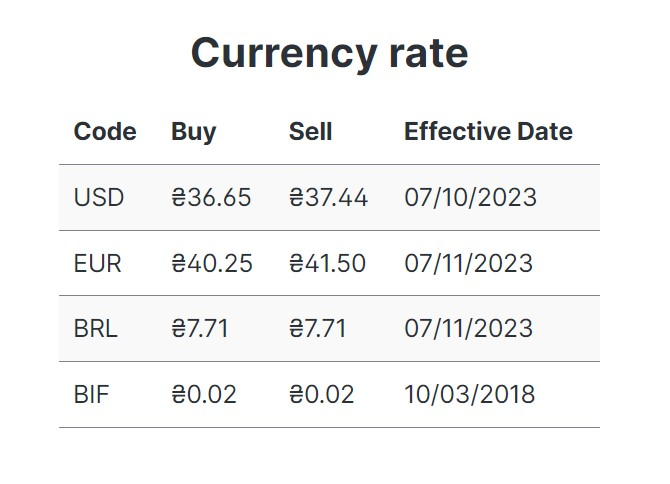
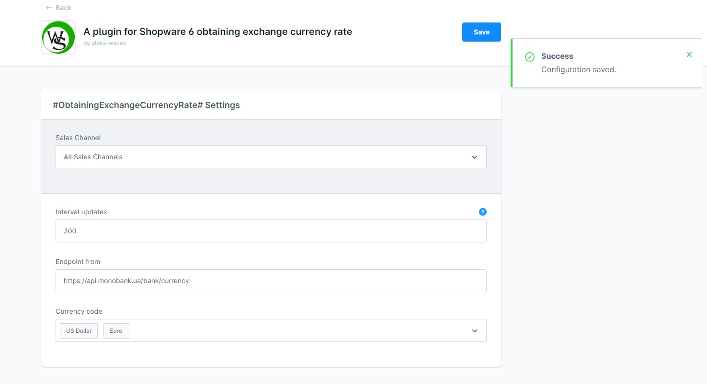
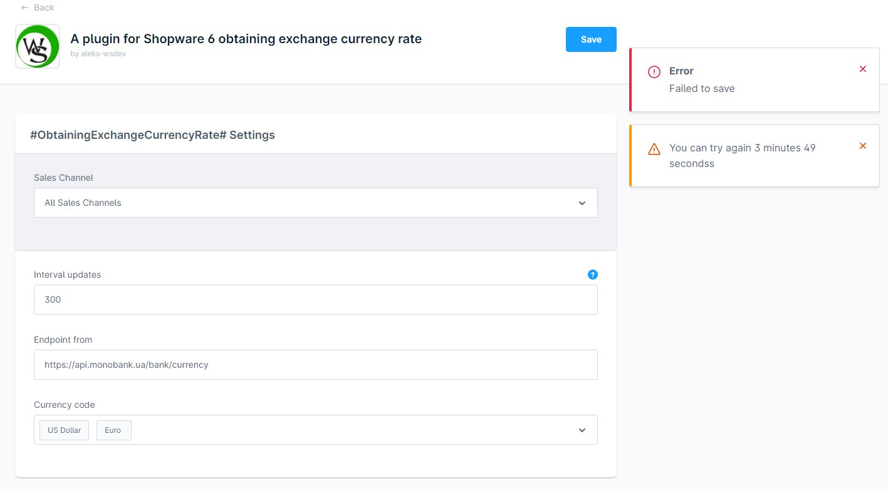
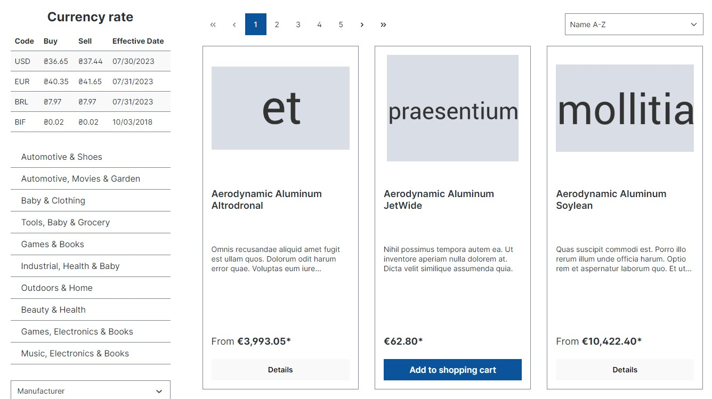

# ObtainingExchangeCurrencyRate

A plugin for Shopware 6 obtaining exchange currency rate Monobank

## System requirements

* Shopware >= 6.5

## Installation

Clone this repository into a folder called **Clock** within the **custom/plugins** directory of the Shopware installation.
* open console and run
```
bin/console plugin:refresh  
bin/console plugin:install --activate --clearCache ObtainingExchangeCurrencyRate
```
Then go to the plugin settings and save them.

## Screenshots
<div align="center">
  
  
  
  
</div>